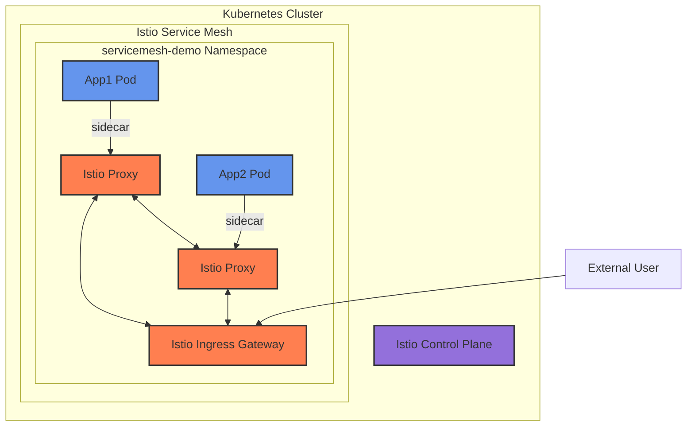
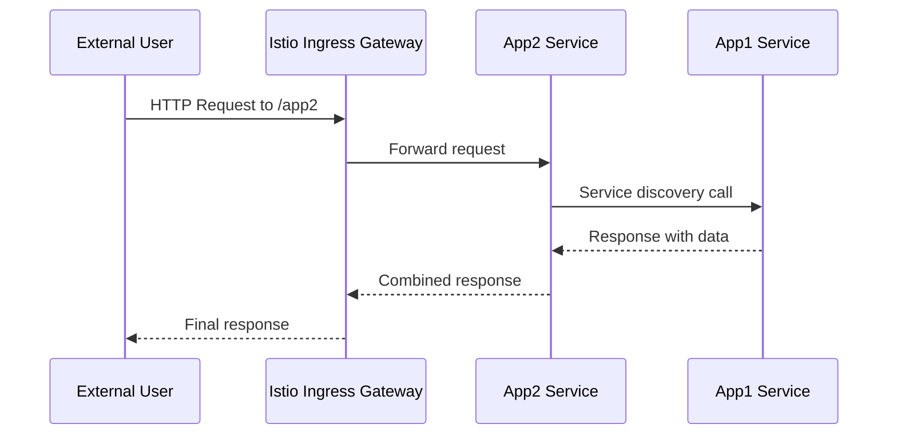
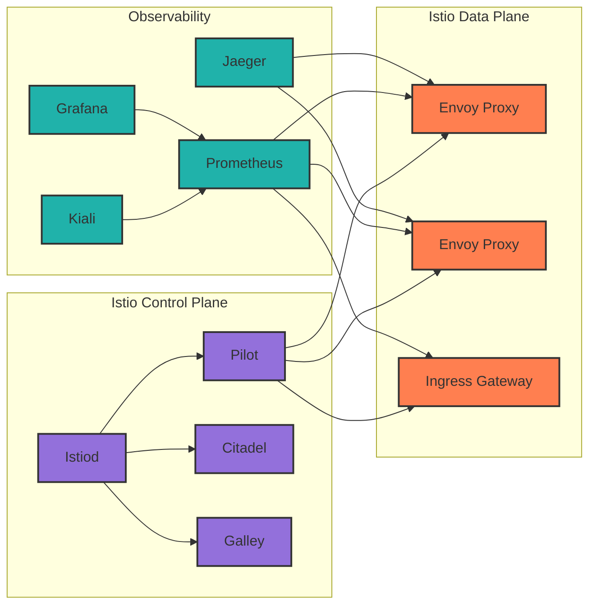
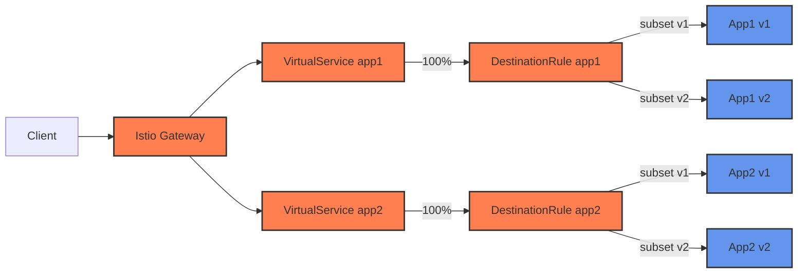
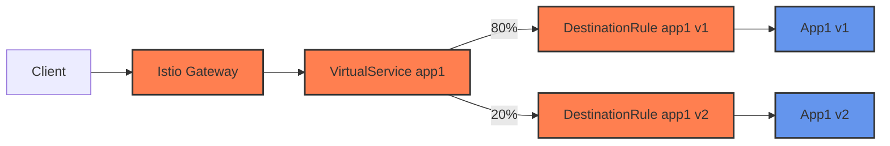
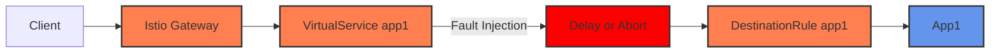
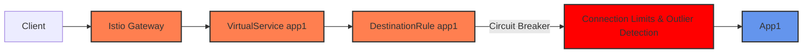
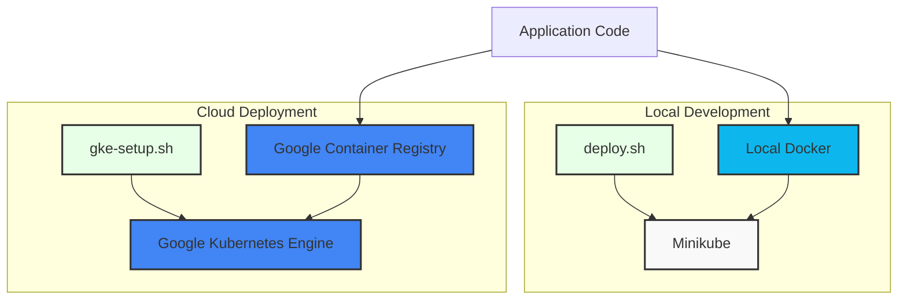

# Service Mesh Architecture Diagrams

This document contains diagrams explaining the structure and architecture of the service mesh demo.

## Overall Architecture



## Service Communication Flow



## Istio Components



## Project Structure

```mermaid
graph TD
    Root[servicemesh-demo] --> App1[app1/]
    Root --> App2[app2/]
    Root --> K8s[kubernetes/]
    Root --> Istio[istio/]
    Root --> Scripts[Scripts]
    
    App1 --> A1[Dockerfile]
    App1 --> A2[package.json]
    App1 --> A3[server.js]
    
    App2 --> B1[Dockerfile]
    App2 --> B2[package.json]
    App2 --> B3[server.js]
    
    K8s --> K1[app1-deployment.yaml]
    K8s --> K2[app2-deployment.yaml]
    
    Istio --> I1[gateway.yaml]
    
    Scripts --> S1[deploy.sh]
    Scripts --> S2[cleanup.sh]
    Scripts --> S3[gke-setup.sh]
    Scripts --> S4[update-version.sh]
    Scripts --> S5[monitor.sh]
    Scripts --> S6[fault-injection.sh]
    Scripts --> S7[circuit-breaker.sh]
    Scripts --> S8[help.sh]
    
    style Root fill:#f9f9f9,stroke:#333,stroke-width:2px
    style App1 fill:#e6f3ff,stroke:#333,stroke-width:2px
    style App2 fill:#e6f3ff,stroke:#333,stroke-width:2px
    style K8s fill:#fff2e6,stroke:#333,stroke-width:2px
    style Istio fill:#ffe6e6,stroke:#333,stroke-width:2px
    style Scripts fill:#e6ffe6,stroke:#333,stroke-width:2px
```



## Traffic Management with Istio



## Canary Deployment with Traffic Splitting



## Fault Injection



## Circuit Breaking



## Minikube vs GKE Deployment



## Observability Stack

```mermaid
graph TB
    subgraph "Istio Service Mesh"
        App1[App1 + Sidecar]
        App2[App2 + Sidecar]
        Gateway[Istio Gateway]
    end
    
    subgraph "Monitoring & Visualization"
        Prometheus[Prometheus]
        Grafana[Grafana]
        Kiali[Kiali]
        Jaeger[Jaeger]
    end
    
    App1 --> Prometheus
    App2 --> Prometheus
    Gateway --> Prometheus
    
    Prometheus --> Grafana
    Prometheus --> Kiali
    
    App1 --> Jaeger
    App2 --> Jaeger
    Gateway --> Jaeger
    
    MonitorScript[monitor.sh] --> Kiali
    MonitorScript --> Grafana
    MonitorScript --> Jaeger
    MonitorScript --> Prometheus
    
    style App1 fill:#6495ED,stroke:#333,stroke-width:2px
    style App2 fill:#6495ED,stroke:#333,stroke-width:2px
    style Gateway fill:#FF7F50,stroke:#333,stroke-width:2px
    style Prometheus fill:#e6194B,stroke:#333,stroke-width:2px
    style Grafana fill:#3cb44b,stroke:#333,stroke-width:2px
    style Kiali fill:#4363d8,stroke:#333,stroke-width:2px
    style Jaeger fill:#f58231,stroke:#333,stroke-width:2px
    style MonitorScript fill:#e6ffe6,stroke:#333,stroke-width:2px
